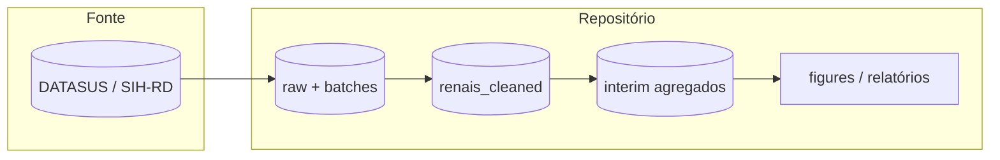
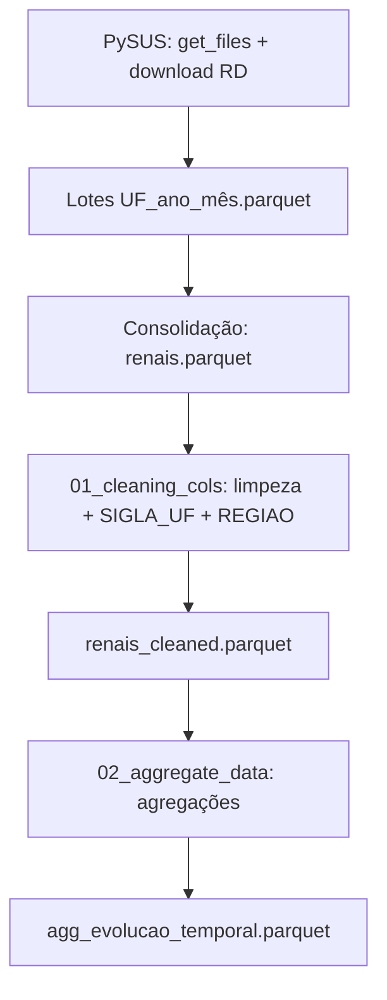
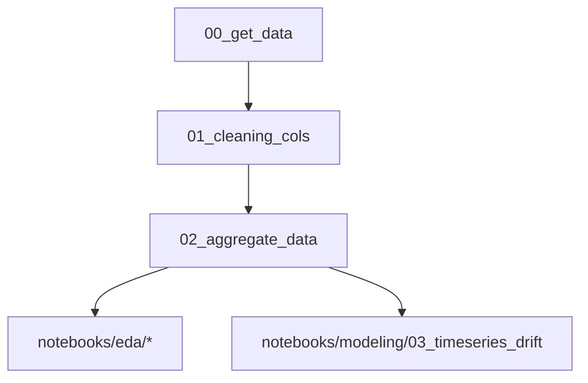
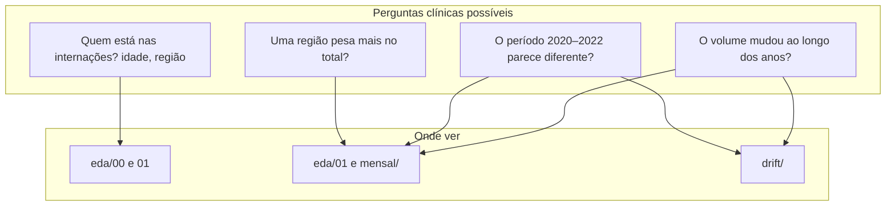
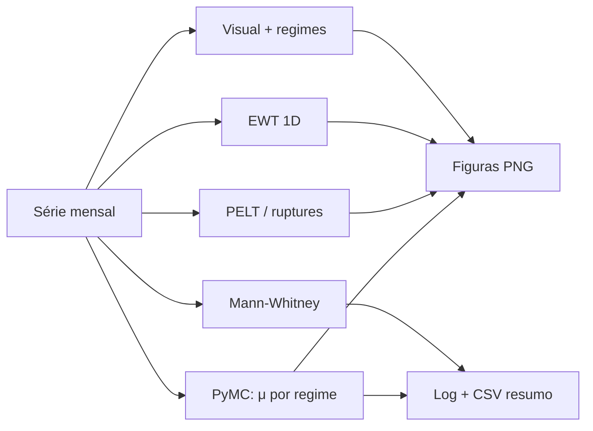
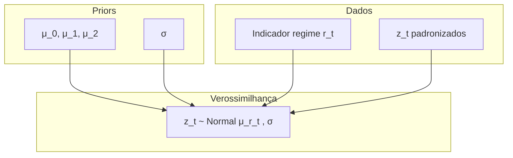

# Documentação técnica — `datasus_lelei`

Análise de internações hospitalares por doença renal (CID N17–N19) no **SIH/SUS**, com escopo geográfico **Sul e Sudeste**, incluindo exploração de **drift** em série temporal (pré-pandemia, pandemia COVID-19, pós-pandemia).

---

## Sumário

1. [Visão geral](#1-visão-geral)
2. [Aquisição e linhagem dos dados](#2-aquisição-e-linhagem-dos-dados)
3. [Pipeline de processamento](#3-pipeline-de-processamento)
4. [Como interpretar os gráficos (guia para estudantes de medicina)](#guia-graficos)
5. [Análise de séries temporais e drift](#5-análise-de-séries-temporais-e-drift)
6. [Decomposição EWT](#6-decomposição-ewt)
7. [Modelo bayesiano por regime](#7-modelo-bayesiano-por-regime)
8. [Artefatos gerados](#8-artefatos-gerados)
9. [Limitações](#9-limitações)

---

## 1. Visão geral



**Objetivo analítico:** estudar o volume mensal de internações no tempo, testar evidência de **mudança de patamar** (drift) entre períodos definidos pelo calendário epidemiológico da COVID-19 (2020–2022) e o período subsequente, usando métodos clássicos (changepoints, testes não paramétricos), decomposição **EWT** e inferência **bayesiana**.

---

## 2. Aquisição e linhagem dos dados

### 2.1 Origem

- **Base:** SIH — Sistema de Informações Hospitalares, arquivo **RD** (AIH reduzida), via biblioteca **PySUS**.
- **Estados (UF):** `PR`, `RS`, `SC`, `SP`, `MG`, `RJ`, `ES` (Sul + Sudeste).
- **Diagnóstico principal:** prefixos de CID renal `N17`, `N18`, `N19`.
- **Granularidade de download:** um arquivo Parquet por **UF × ano × mês** em `data/raw/batches/`.

### 2.2 Linhagem (de dado bruto a série mensal)



**Nota importante:** o campo `UF_ZI` do SIH **não** representa macro-região pelo primeiro dígito. A região **Sul / Sudeste** é obtida a partir de **`SIGLA_UF`**, gravada no lote (ou inferida do nome do ficheiro em lotes antigos) e mapeada no script de limpeza.

---

## 3. Pipeline de processamento

Ordem sugerida (scripts em `notebooks/processing/`):

| Etapa | Script | Saída principal |
|-------|--------|-------------------|
| 0 | `00_get_data.py` | `data/raw/batches/*.parquet`, `data/raw/renais.parquet` |
| 1 | `01_cleaning_cols.py` | `data/raw/renais_cleaned.parquet`, espelho em `data/processed/` |
| 2 | `02_aggregate_data.py` | `data/interim/*.parquet` |



---

<a id="guia-graficos"></a>

## 4. Como interpretar os gráficos (guia para estudantes de medicina)

Este guia foi escrito para quem **não** trabalha com estatística no dia a dia. A ideia é responder: *“O que estou a ver e o que isso pode significar em saúde coletiva?”* — **sem** afirmar causalidade (a pandemia “causou” X): os gráficos mostram **associação no tempo** e **padrões nos dados administrativos**.



### 4.1 O que são estes dados?

- Cada registo é uma **internação hospitalar** registrada no SUS (SIH), com diagnóstico principal renal (N17–N19), na amostra geográfica **Sul + Sudeste**.
- Não é o total do Brasil nem necessariamente todos os doentes renais do país — é o que **entrou nesta base** após filtros e limpeza.

### 4.2 Primeira exploração — `reports/figures/eda/`

Gerado por `notebooks/eda/00_first_eda.py`.

| Ficheiro | O que é o gráfico | Como ler (em linguagem simples) |
|----------|-------------------|----------------------------------|
| **`00_idade_por_regiao.png`** | Barras empilhadas: **idade** das pessoas internadas, cores = **Sul** ou **Sudeste**. | O eixo horizontal é a idade; a altura mostra **quantas internações** caem em cada faixa etária. Se uma cor domina numa idade, essa região contribui mais para internações nessa idade. **Não** diz qual região é “pior em saúde” — só descreve **quem preenche** a base. |
| **`01_volume_por_regiao.png`** | Barras horizontais: **quantas internações** no total da base, separadas por **Sul** e **Sudeste**. | Compara **tamanho bruto** entre as duas macro-regiões na amostra. Quem tem barra mais longa tem **mais registos** neste recorte (pode refletir população maior, oferta de leitos, captação de dados, etc.). |

### 4.3 Evolução no tempo (por ano) — `reports/figures/eda/`

Gerado por `notebooks/eda/01_second_eda.py`. A faixa avermelhada (quando existe) marca **2020–2022** como referência visual à pandemia de COVID-19 — **marco temporal**, não prova de efeito direto nas internações renais.

| Ficheiro | O que é | Como ler |
|----------|---------|----------|
| **`02_evolucao_nacional_2012_2024.png`** | Linha: **total de internações por ano** (Sul+Sudeste agregados). | Se a linha **sobe**, houve **mais internações naquele ano** do que no anterior (no conjunto dos dados). Se **desce**, houve menos. A pandemia está sombreada para **enquadrar** o olhar no tempo; **outros fatores** (acesso, financiamento, codificação) também podem mudar números. |
| **`03_evolucao_por_regiao.png`** | Várias linhas: mesmo conceito, uma por **Sul** e **Sudeste** (ou subdivisões usadas no script). | Compara **ritmo** entre regiões. Linhas paralelas = padrão parecido; linhas que se afastam = uma região cresceu mais que a outra **nesta base**. |
| **`04_pandemia_nacional.png`** | Barras: **soma de todas as internações** em três blocos de calendário: antes de 2020, 2020–2022, e 2023 em diante (rótulos no eixo). | Responde de forma grosseira: *“No total histórico desta base, quanto caiu em cada grande fase?”* Barras mais altas = **mais casos acumulados** naquele bloco (atenção: os blocos têm **durações diferentes** em anos — comparar também os gráficos de **média** abaixo). |
| **`05_pandemia_por_regiao.png`** | Barras agrupadas: mesmo tipo de bloco temporal, mas **separado** por Sul / Sudeste. | Vê se o **padrão** da pandemia (subida/descida relativa) é parecido nas duas regiões ou se uma se destaca. |
| **`06_participacao_regional_pct.png`** | Linhas: em cada **ano**, que **percentagem** do total anual veio de cada região (soma dos % no ano = 100%). | Se uma linha sobe, essa região passou a representar **fatia maior** das internações **nessa amostra** — útil para desigualdade de carga **relativa**, não para incidência populacional (falta o denominador habitante). |
| **`07_variacao_anual_pct_nacional.png`** | Barras: **quanto por cento** o total anual **mudou em relação ao ano anterior** (ex.: +5% ou −3%). | Mostra **aceleração ou travagem** ano a ano. Barra positiva = aumento em relação ao ano anterior; negativa = queda. Valores muito altos ou baixos merecem cautela: podem ser **oscilação** ou mudança de dados, não só doença. |
| **`08_medias_pre_durante_pos.png`** | Barras: **média de internações por ano** dentro de cada fase (pré / durante / pós). | Ajusta um pouco a comparação da figura `04`: em vez de **soma bruta** (que depende de quantos anos tem cada fase), mostra **ritmo médio anual** em cada fase. Útil para dizer: *“Em média, cada ano desse período teve mais ou menos internações que a média de outro período?”* |

### 4.4 Evolução mês a mês — `reports/figures/eda/mensal/`

Gerado por `notebooks/eda/02_second_eda_mensal.py`. Os **mesmos conceitos** da secção anterior, com **mais detalhe** (sazonalidade dentro do ano).

| Ficheiro | Diferença em relação à versão anual |
|----------|-------------------------------------|
| **`02_evolucao_nacional_mensal.png`** | Em vez de um ponto por **ano**, há um ponto por **mês**: vê-se **oscilação** dentro do ano (ex. picos recorrentes). |
| **`03_evolucao_regiao_mensal.png`** | Mesmo detalhe mensal, por região. |
| **`04_pandemia_nacional.png`**, **`05_pandemia_por_regiao.png`** | Igual ideia das barras por fase (totais acumulados por período). |
| **`06_participacao_regional_mensal_pct.png`** | Participação **mensal** — mais “ruído” que o anual; mostra se a fatia regional **oscila** ao longo do ano. |
| **`07_variacao_mensal_pct_nacional.png`** | Mudança **em relação ao mês anterior** (não ao ano). Picos aqui podem refletir **sazonalidade** ou eventos pontuais. |
| **`08_medias_mensais_pre_durante_pos.png`** | **Média por mês** em cada fase: comparável quando se quer falar de **ritmo mensal típico** em cada era. |

### 4.5 Gráficos de série temporal e “drift” — `reports/figures/timeseries_drift/`

Gerado por `notebooks/modeling/03_timeseries_drift.py`. São análises mais técnicas, mas o **recado clínico** pode resumir-se assim: *“Os números de um período parecem vir de uma ‘realidade’ diferente da de outro período?”*

| Ficheiro | Leitura em linguagem simples |
|----------|------------------------------|
| **`01_serie_mensal_regimes.png`** | A curva é o **número de internações por mês**; a zona corada é 2020–2022. Serve para **olhar** se o nível médio ou a variabilidade mudam nessa janela. |
| **`02_ewt_componentes.png`** | Decompõe a série em **camadas** (como separar um sinal em “ondas” lentas e rápidas). A primeira linha é o total; as de baixo são **padrões extraídos automaticamente**. Útil para ver **tendência suave** vs **flutuações** sem memorizar fórmulas. |
| **`03_changepoints_pelt.png`** | Linhas verticais laranja = meses onde um algoritmo sugere **possível mudança de comportamento** na série padronizada. **Não** é diagnóstico clínico — é **indício estatístico** para investigar (dados, políticas, eventos). |
| **`06_histograma_drift_sobreposicao.png`** | Dois histogramas **sobrepostos**: distribuição dos **valores mensais** em dois períodos. Se as formas se separam, os **níveis típicos** de internação mensal diferem entre períodos. |
| **`07_histograma_drift_delta_frequencia.png`** | Mostra a **diferença** entre as duas distribuições, bin a bin: onde uma fase tem **mais** ou **menos** massa que a outra. |
| **`08_` e `09_` (z-score)** | Mesma ideia que `06` e `07`, mas numa escala **normalizada** (comparável ao modelo estatístico). Para leitura clínica, pode ignorar o nome “z-score” e pensar: *“comparar formas sem unidade absoluta”*. |
| **`04_bayes_mu_forest.png`** | Intervalos que resumem **onde a análise estatística “acha”** que está o nível médio de cada fase (na escala padronizada). Intervalos **não sobrepostos** sugerem **diferença consistente** com o modelo usado; sobreposição = menos certeza de diferença. |
| **`05_bayes_contrastes_kde.png`** | Curvas suaves das **diferenças** entre fases. Se a maior parte da área está **à direita do zero**, a análise atribui **probabilidade alta** a um nível maior no segundo período (ver também `resumo_bayesiano.csv`). |
| **`resumo_bayesiano.csv`** | Números como `P_mu_pandemia_gt_pre`: probabilidade aproximada de que o **patamar** na pandemia seja maior que no pré — **no modelo simplificado** usado (ver limitações na secção 9). |

### 4.6 Frases que um estudante de medicina pode usar (e frases a evitar)

**Pode dizer (com cautela):**

- “Nesta base Sul+Sudeste, o **volume** de internações renais **associado** ao período X foi maior/menor que no período Y.”
- “A **participação relativa** da região Sul aumentou ao longo dos anos **nesta amostra**.”
- “Há **indícios estatísticos** de mudança de patamar entre fases; isso **não** isola o efeito da COVID-19 nem substitui estudo causal.”

**Evite afirmar sem outras evidências:**

- “A pandemia **causou** o aumento das internações renais.”
- “O Sudeste tem mais doença renal” (sem taxa por habitante).
- “O gráfico **prova** que o sistema colapsou” (colapso exige dados de leitos, filas, mortalidade, etc.).

---

## 5. Análise de séries temporais e drift

**Série analisada:** total **mensal** de internações no escopo Sul+Sudeste (agregado nacional da amostra), lida de `agg_evolucao_temporal.parquet` (colunas `ANO`, `MES`, `TOTAL`).

### 5.1 O que significa “drift” aqui

Usamos o termo no sentido de **mudança de distribuição** dos níveis mensais entre blocos temporais:

| Regime | Critério (calendário) |
|--------|------------------------|
| Pré-pandemia | ano &lt; 2020 |
| Pandemia | 2020 ≤ ano ≤ 2022 |
| Pós-pandemia | ano ≥ 2023 |

### 5.2 Métodos implementados (`notebooks/modeling/03_timeseries_drift.py`)



1. **Visualização** — série com faixa 2020–2022.
2. **PELT** (`ruptures`, custo `l2`) — pontos de mudança em série **padronizada**; penalidade proporcional a \(\log(n)\hat\sigma^2)\) (heurística comum).
3. **Mann-Whitney** — comparação de distribuições de níveis entre pares de regimes (não assume normalidade).
4. **Bayesiano** — modelo gaussiano com médias distintas por regime na série padronizada (ver secção 7).

---

## 6. Decomposição EWT

A **Transformada Wavelet Empírica (EWT)** de Gilles adapta filtros passa-banda a partir do espectro do sinal, separando modos oscilatórios sem fixar à priori o número de harmónicos como em STL clássico.

- **Implementação:** pacote `pyewt` (`ewt1d`).
- **Entrada:** série **centrada** (média removida) para estabilidade numérica.
- **Parâmetros:** derivados de `Default_Params()`, com `N` limitado em função do comprimento da série.
- **Saída gráfica:** painel com o sinal em níveis e cada componente EWT ao longo do tempo.

Interpretação: componentes de alta frequência capturam variação intra-ano/ruído; componentes de baixa frequência aproximam **tendência** e ciclos lentos. Não confundir com “sazonalidade clássica mensal” extraída por X-13; a EWT é **adaptativa ao espectro empírico**.

---

## 7. Modelo bayesiano por regime

### 7.1 Especificação

Para cada mês \(t\), com \(y_t\) = total de internações e \(z_t = (y_t - \bar y)/s_y\):

\[
z_t \sim \mathcal{N}(\mu_{r(t)}, \sigma),
\quad r(t) \in \{\text{pré}, \text{pandemia}, \text{pós}\}
\]

**Priors:** \(\mu_k \sim \mathcal{N}(0, 1.5)\), \(\sigma \sim \text{HalfNormal}(1)\) (em unidades de \(z\)).

### 7.2 Quantidades de interesse

A partir das amostras **NUTS** (PyMC), calculam-se probabilidades posteriores do tipo:

- \(P(\mu_{\text{pandemia}} > \mu_{\text{pré}} \mid \text{dados})\)
- \(P(\mu_{\text{pós}} > \mu_{\text{pré}} \mid \text{dados})\)
- \(P(\mu_{\text{pós}} > \mu_{\text{pandemia}} \mid \text{dados})\)

Valores numéricos da última execução local estão em:

`reports/figures/timeseries_drift/resumo_bayesiano.csv`

### 7.3 Diagrama do modelo (nível conceitual)



**Advertência:** o modelo trata cada observação mensal como **i.i.d. condicionalmente** ao regime, **sem** componente AR ou sazonalidade explícita. Serve como **teste de patamar** entre blocos, não como previsão ou causalidade estrita (políticas, acesso, subnotificação, mudanças de codificação CID etc. não são modelados).

---

## 8. Artefatos gerados

### 8.1 Drift / série temporal (`reports/figures/timeseries_drift/`)

| Caminho | Conteúdo |
|---------|----------|
| `01_serie_mensal_regimes.png` | Série mensal + faixa pandemia |
| `02_ewt_componentes.png` | EWT 1D — componentes |
| `03_changepoints_pelt.png` | PELT em série padronizada |
| `04_bayes_mu_forest.png` | Forest plot \(\mu_k\) |
| `05_bayes_contrastes_kde.png` | KDE das diferenças \(\Delta\mu\) |
| `06_histograma_drift_sobreposicao.png` | Histogramas sobrepostos (níveis) |
| `07_histograma_drift_delta_frequencia.png` | Δ frequência relativa por bin |
| `08_histograma_drift_zscore_sobreposicao.png` | Histogramas sobrepostos (z-score) |
| `09_histograma_drift_delta_frequencia_zscore.png` | Δ frequência (z-score) |
| `resumo_bayesiano.csv` | Probabilidades e médias posteriores |

**Comando:**

```bash
uv run python notebooks/modeling/03_timeseries_drift.py
```

Recomenda-se `MPLBACKEND=Agg` em servidores sem display.

### 8.2 EDA (resumo de pastas)

| Pasta | Scripts |
|-------|---------|
| `reports/figures/eda/` | `00_first_eda.py`, `01_second_eda.py` |
| `reports/figures/eda/mensal/` | `02_second_eda_mensal.py` |

---

## 9. Limitações

- **População:** não há denominador populacional; “taxas por 100 mil hab.” exigiriam projeções IBGE por UF/região.
- **Independência mensal:** o modelo bayesiano simplificado ignora autocorrelação temporal; para decisões críticas, estender para **modelos dinâmicos** ou **changepoint bayesiano** explícito.
- **Causalidade:** diferenças entre regimes **não** são atribuíveis só à pandemia; são associadas temporalmente.
- **Arviz / PyMC:** o projeto fixa `arviz>=0.17,<1` por compatibilidade com PyMC 5.x (ArviZ 1.x alterou a API de importação).

---

## Referências conceituais (leitura)

- Gilles, J. *Empirical Wavelet Transform* (trabalhos de referência da implementação `pyewt`).
- Truong et al. *ruptures* — detecção de mudanças de regime (PELT).
- PyMC — inferência bayesiana e NUTS.

---

*Documento gerado como parte do repositório `datasus_lelei`; alinhar números concretos sempre com o CSV e figuras mais recentes após reexecutar o pipeline.*
