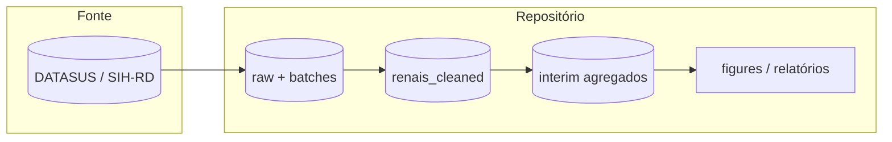
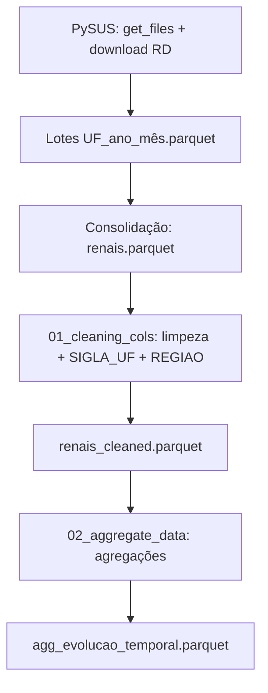
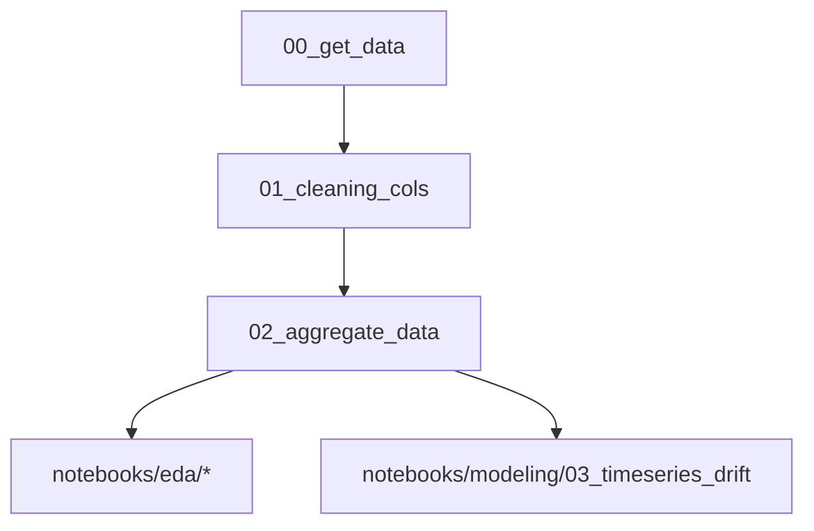
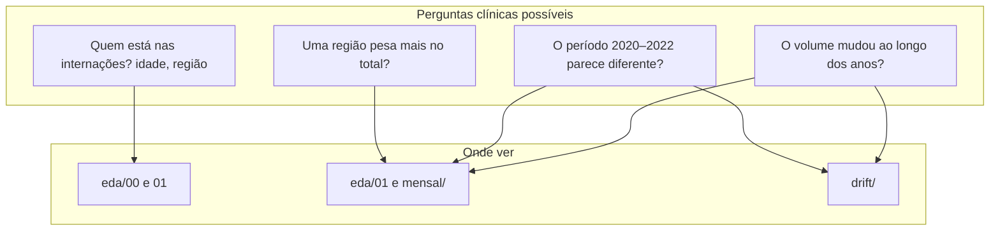
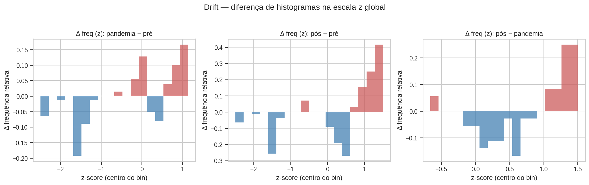
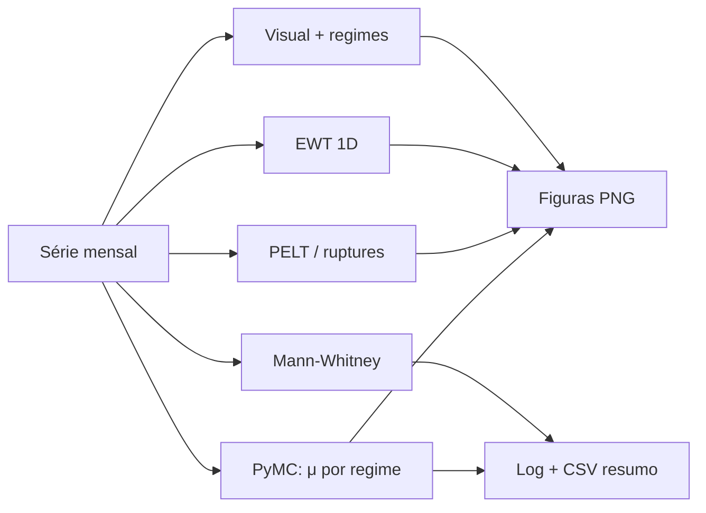
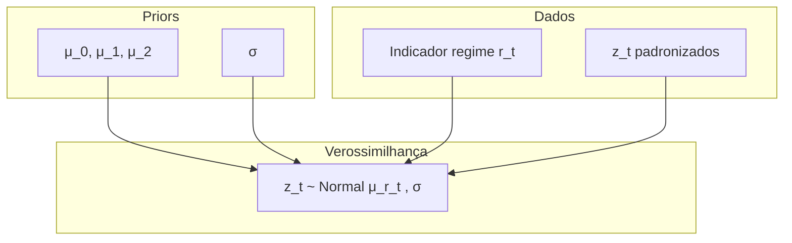

# Documentação técnica — `datasus_lelei`

Análise de internações hospitalares por doença renal (CID N17–N19) no **SIH/SUS**, com escopo geográfico **Sul e Sudeste**, incluindo exploração de **drift** em série temporal (pré-pandemia, pandemia COVID-19, pós-pandemia).

---

## Sumário

1. [Visão geral](#1-visão-geral)
2. [Aquisição e linhagem dos dados](#2-aquisição-e-linhagem-dos-dados)
3. [Pipeline de processamento](#3-pipeline-de-processamento)
4. [Como interpretar os gráficos (guia para estudantes de medicina)](#guia-graficos)
5. [Análise de séries temporais e drift](#5-análise-de-séries-temporais-e-drift)
6. [Decomposição EWT](#6-decomposição-ewt)
7. [Modelo bayesiano por regime](#7-modelo-bayesiano-por-regime)
8. [Artefatos gerados](#8-artefatos-gerados)
9. [Limitações](#9-limitações)

---

## 1. Visão geral



**Objetivo analítico:** estudar o volume mensal de internações no tempo, testar evidência de **mudança de patamar** (drift) entre períodos definidos pelo calendário epidemiológico da COVID-19 (2020–2022) e o período subsequente, usando métodos clássicos (changepoints, testes não paramétricos), decomposição **EWT** e inferência **bayesiana**.

---

## 2. Aquisição e linhagem dos dados

### 2.1 Origem

- **Base:** SIH — Sistema de Informações Hospitalares, arquivo **RD** (AIH reduzida), via biblioteca **PySUS**.
- **Estados (UF):** `PR`, `RS`, `SC`, `SP`, `MG`, `RJ`, `ES` (Sul + Sudeste).
- **Diagnóstico principal:** prefixos de CID renal `N17`, `N18`, `N19`.
- **Granularidade de download:** um arquivo Parquet por **UF × ano × mês** em `data/raw/batches/`.

### 2.2 Linhagem (de dado bruto a série mensal)



**Nota importante:** o campo `UF_ZI` do SIH **não** representa macro-região pelo primeiro dígito. A região **Sul / Sudeste** é obtida a partir de **`SIGLA_UF`**, gravada no lote (ou inferida do nome do ficheiro em lotes antigos) e mapeada no script de limpeza.

---

## 3. Pipeline de processamento

Ordem sugerida (scripts em `notebooks/processing/`):

| Etapa | Script | Saída principal |
|-------|--------|-------------------|
| 0 | `00_get_data.py` | `data/raw/batches/*.parquet`, `data/raw/renais.parquet` |
| 1 | `01_cleaning_cols.py` | `renais_cleaned.parquet`, `.csv`, `.xlsx` em `data/raw/` e `data/processed/` |
| 2 | `02_aggregate_data.py` | `data/interim/*.parquet` |



---

<a id="guia-graficos"></a>

## 4. Como interpretar os gráficos (guia para estudantes de medicina)

Este guia foi escrito para quem **não** trabalha com estatística no dia a dia. A ideia é responder: *“O que estou a ver e o que isso pode significar em saúde coletiva?”* — **sem** afirmar causalidade (a pandemia “causou” X): os gráficos mostram **associação no tempo** e **padrões nos dados administrativos**.



### 4.1 O que são estes dados?

- Cada registo é uma **internação hospitalar** registrada no SUS (SIH), com diagnóstico principal renal (N17–N19), na amostra geográfica **Sul + Sudeste**.
- Não é o total do Brasil nem necessariamente todos os doentes renais do país — é o que **entrou nesta base** após filtros e limpeza.

### 4.2 Primeira exploração — `reports/figures/eda/`

Gerado por `notebooks/eda/00_first_eda.py`.

| Ficheiro | O que é o gráfico | Como ler (em linguagem simples) |
|----------|-------------------|----------------------------------|
| **`00_idade_por_regiao.png`** | Barras empilhadas: **idade** das pessoas internadas, cores = **Sul** ou **Sudeste**. | O eixo horizontal é a idade; a altura mostra **quantas internações** caem em cada faixa etária. Se uma cor domina numa idade, essa região contribui mais para internações nessa idade. **Não** diz qual região é “pior em saúde” — só descreve **quem preenche** a base. |
| **`01_volume_por_regiao.png`** | Barras horizontais: **quantas internações** no total da base, separadas por **Sul** e **Sudeste**. | Compara **tamanho bruto** entre as duas macro-regiões na amostra. Quem tem barra mais longa tem **mais registos** neste recorte (pode refletir população maior, oferta de leitos, captação de dados, etc.). |
| **`09_cids_renais_contagem.png`** | Barras horizontais: **quantas internações** por **CID renal** de diagnóstico principal — só códigos do **capítulo N17–N19** (CID-10), alinhado ao filtro da extração SIH. | Mostra **quais subcódigos renais** (ex. N18.x, N19.x) dominam a amostra. Não é prevalência populacional; **vazios ou fora de N17–N19** não entram no gráfico. |
| **`10_cids_renais_por_periodo_pandemia.png`** | Igual ao anterior, com barras **empilhadas** por **pré / pandemia / pós** (ano da internação). | Vê se a **mistura de CIDs renais** mudou entre eras. **Durações diferentes** por fase — comparar também **fatias** dentro de cada barra. |

### 4.3 Evolução no tempo (por ano) — `reports/figures/eda/`

Gerado por `notebooks/eda/01_second_eda.py`. A faixa avermelhada (quando existe) marca **2020–2022** como referência visual à pandemia de COVID-19 — **marco temporal**, não prova de efeito direto nas internações renais.

| Ficheiro | O que é | Como ler |
|----------|---------|----------|
| **`02_evolucao_nacional_2012_2024.png`** | Linha: **total de internações por ano** (Sul+Sudeste agregados). | Se a linha **sobe**, houve **mais internações naquele ano** do que no anterior (no conjunto dos dados). Se **desce**, houve menos. A pandemia está sombreada para **enquadrar** o olhar no tempo; **outros fatores** (acesso, financiamento, codificação) também podem mudar números. |
| **`03_evolucao_por_regiao.png`** | Várias linhas: mesmo conceito, uma por **Sul** e **Sudeste** (ou subdivisões usadas no script). | Compara **ritmo** entre regiões. Linhas paralelas = padrão parecido; linhas que se afastam = uma região cresceu mais que a outra **nesta base**. |
| **`04_pandemia_nacional.png`** | Barras: **soma de todas as internações** em três blocos de calendário: antes de 2020, 2020–2022, e 2023 em diante (rótulos no eixo). | Responde de forma grosseira: *“No total histórico desta base, quanto caiu em cada grande fase?”* Barras mais altas = **mais casos acumulados** naquele bloco (atenção: os blocos têm **durações diferentes** em anos — comparar também os gráficos de **média** abaixo). |
| **`05_pandemia_por_regiao.png`** | Barras agrupadas: mesmo tipo de bloco temporal, mas **separado** por Sul / Sudeste. | Vê se o **padrão** da pandemia (subida/descida relativa) é parecido nas duas regiões ou se uma se destaca. |
| **`06_contagem_regional_empilhada_ano.png`** | Barras **empilhadas** por **ano**: altura total = internações Sul+Sudeste naquele ano; cada cor é a **contagem** de uma região. | Lê-se em **números absolutos** (mais intuitivo que percentagem): a fatia visual de cada cor ainda mostra **proporção** entre regiões, mas o eixo Y é **casos/ano**. Para comparar só linhas por região, ver também `03_evolucao_por_regiao.png`. |
| **`07_variacao_anual_pct_nacional.png`** | Barras: **quanto por cento** o total anual **mudou em relação ao ano anterior** (ex.: +5% ou −3%). | Mostra **aceleração ou travagem** ano a ano. Barra positiva = aumento em relação ao ano anterior; negativa = queda. Valores muito altos ou baixos merecem cautela: podem ser **oscilação** ou mudança de dados, não só doença. |
| **`08_medias_pre_durante_pos.png`** | Barras: **média de internações por ano** dentro de cada fase (pré / durante / pós). | Ajusta um pouco a comparação da figura `04`: em vez de **soma bruta** (que depende de quantos anos tem cada fase), mostra **ritmo médio anual** em cada fase. Útil para dizer: *“Em média, cada ano desse período teve mais ou menos internações que a média de outro período?”* |

#### Taxa por população (IBGE — só Sul e Sudeste)

Gerado por `notebooks/eda/03_eda_taxa_populacao.py`. O denominador vem de `data/external/ibge_populacao_sul_sudeste.csv` (habitantes **Sul** e **Sudeste** por ano; valores alinhados à tabela IBGE que forneceste). O escopo agregado usa **soma das populações** das duas regiões — **não** a linha “TOTAL” nacional da tabela original.

| Ficheiro | O que é | Como ler |
|----------|---------|----------|
| **`11_taxa_internacoes_100k_por_regiao.png`** | Linhas: **internações por 100 mil habitantes** em **Sul** e em **Sudeste**, cada uma com o **próprio denominador regional**. | Compara **carga relativa à população** entre macro-regiões. Ainda é taxa de **internação SIH** (captação, codificação, oferta), não incidência clínica literal na comunidade. |
| **`12_taxa_internacoes_100k_escopo_sul_mais_sudeste.png`** | Uma linha: **todas as internações Sul+Sudeste** no numerador e **POP_SUL + POP_SUDESTE** no denominador. | É o “total” do teu recorte geográfico **padronizado por população do mesmo recorte**. |

Tabela numérica: `reports/tables/taxa_internacoes_100k_sul_sudeste.csv`.

### 4.4 Evolução mês a mês — `reports/figures/eda/mensal/`

Gerado por `notebooks/eda/02_second_eda_mensal.py`. Os **mesmos conceitos** da secção anterior, com **mais detalhe** (sazonalidade dentro do ano).

| Ficheiro | Diferença em relação à versão anual |
|----------|-------------------------------------|
| **`02_evolucao_nacional_mensal.png`** | Em vez de um ponto por **ano**, há um ponto por **mês**: vê-se **oscilação** dentro do ano (ex. picos recorrentes). |
| **`03_evolucao_regiao_mensal.png`** | Mesmo detalhe mensal, por região. |
| **`04_pandemia_nacional.png`**, **`05_pandemia_por_regiao.png`** | Igual ideia das barras por fase (totais acumulados por período). |
| **`06_contagem_regional_mensal.png`** | Linhas: **contagem de internações por mês** e por região (não é percentagem); mais “ruído” que o anual. A composição relativa entre regiões infere-se pela distância entre linhas. |
| **`07_variacao_mensal_pct_nacional.png`** | Mudança **em relação ao mês anterior** (não ao ano). Picos aqui podem refletir **sazonalidade** ou eventos pontuais. |
| **`08_medias_mensais_pre_durante_pos.png`** | **Média por mês** em cada fase: comparável quando se quer falar de **ritmo mensal típico** em cada era. |

### 4.5 Gráficos de série temporal e “drift” — `reports/figures/timeseries_drift/`

Gerado por `notebooks/modeling/03_timeseries_drift.py`. São análises mais técnicas, mas o **recado clínico** pode resumir-se assim: *“Os números de um período parecem vir de uma ‘realidade’ diferente da de outro período?”*

| Ficheiro | Leitura em linguagem simples |
|----------|------------------------------|
| **`01_serie_mensal_regimes.png`** | A curva é o **número de internações por mês**; a zona corada é 2020–2022. Serve para **olhar** se o nível médio ou a variabilidade mudam nessa janela. |
| **`02_ewt_componentes.png`** | Decompõe a série em **camadas** (como separar um sinal em “ondas” lentas e rápidas). A primeira linha é o total; as de baixo são **padrões extraídos automaticamente**. Útil para ver **tendência suave** vs **flutuações** sem memorizar fórmulas. |
| **`03_changepoints_pelt.png`** | A **curva azul** é o **número real de internações por mês**. As **linhas laranja** são meses em que o algoritmo **PELT** sugere que o **patamar médio** da série pode ter mudado (ver secção 5.2.1). **Não** usa z-score. |
| **`06_histograma_drift_sobreposicao.png`** | Dois histogramas **sobrepostos** com o mesmo eixo de bins: a altura de cada barra é o **número de meses** cujo volume caiu naquele intervalo de internações/mês (não é densidade normalizada). Se as formas se separam, os **níveis típicos** diferem entre períodos. |
| **`13_histograma_drift_sobreposicao_taxa_100k.png`** | Mesma lógica que o `06`, mas cada mês é convertido em **taxa**: internações daquele mês **÷ população Sul+Sudeste daquele ano civil** × 100 000 (CSV em `data/external/`). O eixo X é **internações por 100 mil habitantes (mês)**; o Y continua a ser **contagem de meses** por bin. |
| **`07_histograma_drift_delta_frequencia.png`** | **Mesma informação que o “mapa de drift” em escala real:** para cada faixa de internações/mês, quanto a **frequência relativa** de um período **ganhou ou perdeu** em relação ao outro (ver detalhe abaixo com a fig. 11). |
| **`11_histograma_drift_delta_niveis_milhares.png`** | **Igual ao `07`**, mas o eixo horizontal está em **milhares** de internações/mês (ex.: 5 = 5000/mês). Útil para apresentações em que números grandes dificultam a leitura. |
| **`08_histograma_drift_zscore_sobreposicao.png`** | Como o `06`, mas cada mês foi convertido em **“afastamento da média”** (z-score): valores perto de 0 = meses “típicos”; valores altos = meses com volume muito acima da média histórica da série. |
| **`09_histograma_drift_delta_frequencia_zscore.png`** | **Onde está o drift em termos de “meses normais vs extremos”** (ver subsecção dedicada e imagem em baixo). |
| **`04_bayes_mu_forest.png`** | Intervalos que resumem **onde o modelo “acha”** o nível médio de cada fase, na **escala z** (padronizada). Intervalos **quase sem sobreposição** sugerem patamares diferentes **dentro desse modelo**. |
| **`05_bayes_contrastes_kde.png`** | Ver subsecção **4.5.1** (KDE em z). |
| **`10_bayes_kde_contrastes_internacoes_mes.png`** | Ver subsecção **4.5.1** (KDE na escala de internações/mês). |
| **`resumo_bayesiano.csv`** | Probabilidades como `P_mu_pandemia_gt_pre`: fração das simulações em que o patamar da pandemia ficou **acima** do pré — **no modelo usado** (secção 9: limitações). |

#### 4.5.1 O que foi feito no modelo bayesiano e nos gráficos KDE (`05` e `10`)

**Passo a passo (sem fórmulas pesadas):**

1. Pegámos em **cada mês** o total de internações e transformámos numa escala padrão (**z**): subtrair a média de todos os meses e dividir pelo desvio-padrão. Assim, “0” é aproximadamente um mês “no meio do caminho” da série; valores positivos = meses com **mais** internações que a média histórica.
2. Classificámos cada mês num de **três blocos de calendário**: pré-pandemia, 2020–2022, pós (2023+).
3. O computador correu um **modelo bayesiano** simples: em cada bloco, assume-se que os z dos meses se comportam como um “monte” à volta de uma **média desconhecida** μ (uma por bloco), com dispersão comum. **Prior** = crença fraca antes de ver os dados; **posterior** = crença atualizada **depois** dos dados, representada por **milhares de valores simulados** (MCMC/NUTS) para cada μ.
4. O ficheiro **`resumo_bayesiano.csv`** resume perguntas do tipo: *“Em que percentagem das simulações a média da pandemia ficou acima da do pré?”* — isso é o `P_mu_*`.

**O que é o KDE no `05_bayes_contrastes_kde.png`?**  
**KDE** (*kernel density estimate*) é uma **curva suave** que aproxima o histograma das **diferenças** entre simulações, por exemplo μ_pandemia − μ_pré. Não é um novo modelo: é só uma forma **legível** de mostrar onde a massa das diferenças cai. A **linha vermelha vertical no zero** marca “nenhuma diferença”. Se a área verde está **quase toda à direita** do zero, o modelo dá **probabilidade alta** a “pandemia acima do pré” (coerente com o CSV).

**E o `10_bayes_kde_contrastes_internacoes_mes.png`?**  
É o **mesmo conjunto de simulações** que no `05`, mas cada diferença em z foi **multiplicada pelo desvio-padrão** da série original de internações/mês. Assim, o eixo passa a ser **“diferença aproximada de patamar em internações por mês”** (útil clinicamente). **Nota:** isto traduz a **diferença entre médias dos blocos na escala z** para a escala dos totais mensais; **não** substitui um modelo completo com incerteza em todas as camadas, mas **ajuda a intuição**.

#### 4.5.2 Figura `09` — diferença de histogramas em z-score (drift de “forma”)



##### Em uma frase

Este gráfico responde: *“Comparando dois períodos, **em que tipo de mês** (muito calmo, médio, ou muito intenso) a série passou a **passar mais ou menos tempo**?”* — medido em relação à **média de toda a série**, não em números absolutos de leitos.

##### Analogia rápida (para explicar a alguém)

Imaginem que, durante vários anos, anotaram **cada mês** “quantas internações renais houve” e calcularam a **média** de todos esses meses. Depois, para **cada mês**, perguntam: *“Este mês foi mais baixo ou mais alto do que essa média histórica — e **quanto**?”*  
O **z-score** é só isso: **o afastamento à média**, medido em “tamanhos de chapéu” iguais (desvios-padrão), para poder comparar **formas** sem se perder nos milhares de internações.

- **Z perto de 0** → mês “parecido com o típico” da série inteira.  
- **Z negativo** → mês **mais calmo** que o típico.  
- **Z positivo grande** → mês **muito intenso** em relação ao histórico.

A figura `09` **não** diz quantos doentes; diz **em que zona desse ranking** cada período concentra mais ou menos meses.

##### Quem é **A** e quem é **B**? (regra fixa)

Nos gráficos **`07`**, **`09`** e **`11`**, o título de cada painel tem a forma **«X − Y»** (por exemplo *pandemia − pré*). No código calcula-se sempre:

**Δ = (frequência relativa de X) − (frequência relativa de Y)**  

| Símbolo na doc | É o período… | No título aparece… |
|----------------|--------------|---------------------|
| **A** | O da **esquerda** do sinal **−** (o **primeiro** nome) | Ex.: **pandemia** em *pandemia − pré* |
| **B** | O da **direita** do **−** (o **segundo** nome) | Ex.: **pré** em *pandemia − pré* |

**Painéis concretos:**

| Título no gráfico | **A** (minuendo) | **B** (subtraendo) |
|-------------------|------------------|---------------------|
| pandemia − pré | meses **pandemia** (2020–2022) | meses **pré** (&lt; 2020) |
| pós − pré | meses **pós** (≥ 2023) | meses **pré** |
| pós − pandemia | meses **pós** | meses **pandemia** |

- **Barra vermelha (Δ &gt; 0):** nessa faixa do eixo, **A** tem **maior** proporção de meses do que **B**.  
- **Barra azul (Δ &lt; 0):** **A** tem **menor** proporção do que **B**.

*(O mesmo critério vale para `07`/`11`, só muda a unidade do eixo: internações/mês em vez de z-score.)*

##### O que foi feito tecnicamente (passo a passo)

1. **Uma linha do tempo** com um valor por mês: total de internações naquele mês (Sul+Sudeste, base limpa).  
2. **Média** e **desvio-padrão** de **todos** esses meses juntos.  
3. Cada mês vira **z = (mês − média) / desvio-padrão**.  
4. Escolhem-se **faixas** de z (bins) no eixo horizontal — cada barra corresponde a uma faixa (ex.: “entre z ≈ −1 e z ≈ 0”).  
5. Para **cada período** (pré, pandemia, pós), conta-se: *“Que **percentagem** dos meses desse período cai em cada faixa?”* (as percentagens de um período somam 100% ao longo das faixas).  
6. Para cada faixa, calcula-se **Δ = %A − %B**, com **A** e **B** dados pelo título **«A − B»** (tabela acima).  
7. **Vermelho** = Δ positivo; **azul** = Δ negativo.

##### Como ler **uma** barra

- Olhe para o **título**: o **primeiro** período é **A**, o **segundo** é **B**.  
- **Barra vermelha para cima:** nessa faixa, **A** concentra uma **maior** fatia dos seus meses do que **B** dos seus.  
- **Barra azul para baixo:** **A** concentra uma **menor** fatia nessa faixa do que **B**.

Ou seja: estamos a comparar **dois histogramas** (dois períodos) e a desenhar **a diferença** faixa a faixa.

##### Os três painéis — mensagem principal

| Painel | Comparação | Leitura em palavras simples |
|--------|------------|-----------------------------|
| **Esquerda** | Pandemia **−** pré | Tendência para **menos** meses “abaixo do típico” (z mais baixo) e **mais** meses “acima do típico” (z mais alto) na pandemia do que antes. |
| **Centro** | Pós **−** pré | O deslocamento reforça-se: comparado ao pré, o pós acumula ainda mais nos **z altos** — mais meses **muito acima** da média histórica. |
| **Direita** | Pós **−** pandemia | Mesmo comparando com a pandemia (já um período alto), o pós pode mostrar **ainda mais** ênfase nos **z mais extremos** à direita — ou seja, continuação do padrão de meses “fora do comum” em relação a **toda** a série. |

**Cuidado:** “fora do comum” aqui é **só** em relação à própria série (média e dispersão dos meses que temos). Não é um limiar clínico nem meta de serviço.

##### Roteiro de ~2 minutos para explicares em apresentação

1. *“Temos um valor por mês: internações. Primeiro vemos a média global de todos os meses.”*  
2. *“O z-score diz se cada mês foi mais baixo ou mais alto que essa média, numa escala comum.”*  
3. *“Este gráfico não mostra o número de doentes; mostra **onde** cada período concentra os meses nessa escala.”*  
4. *“No título, **A − B**: o **primeiro** nome é A, o **segundo** é B. Cada barra é **% de A na faixa** menos **% de B na faixa**. Vermelho: A ganhou relativamente a B nessa faixa; azul: A perdeu.”*  
5. *“Nos três painéis vemos que, ao longo do tempo, há deslocamento para a direita: mais meses intensos em relação ao nosso próprio histórico.”*  
6. *“Isto é **descritivo** e **associado no tempo**; não prova que a COVID-19 causou nem substitui análise de causa com outros dados.”*

##### Perguntas frequentes ao apresentar

- **“Porque não aparecem internações no eixo?”** — Porque estamos a comparar a **forma** da distribuição numa escala neutra; para números absolutos usa-se a figura `07` ou `11`.  
- **“O que é drift de forma?”** — A **forma** do “monte” de meses mudou entre períodos: não só a média, mas **onde** a massa se concentra nas faixas de intensidade.  
- **“Os bins somam o quê?”** — Dentro de **cada** período, as frequências relativas entre faixas somam 100%; o gráfico mostra **diferenças** entre dois períodos.

##### O que este gráfico **não** permite concluir

- Não dá **taxa por habitante** (falta população).  
- Não identifica **causa** (pandemia, acesso, codificação, etc.).  
- Não substitui **revisão clínica** ou de gestão dos serviços.

#### 4.5.3 Figuras `07` vs `11` vs `09` — qual usar?

| Figura | Eixo X | Melhor para… |
|--------|--------|----------------|
| **07** | Internações/mês (valor real) | Quem quer números **absolutos** do SIH. |
| **11** | Milhares de internações/mês | **Apresentações**; evita muitos zeros no eixo. |
| **09** | z-score | Comparar com o **modelo bayesiano** e falar de “meses típicos vs extremos” **sem** fixar primeiro o número exato de leitos. |

### 4.6 Frases que um estudante de medicina pode usar (e frases a evitar)

**Pode dizer (com cautela):**

- “Nesta base Sul+Sudeste, o **volume** de internações renais **associado** ao período X foi maior/menor que no período Y.”
- “A **participação relativa** da região Sul aumentou ao longo dos anos **nesta amostra**.”
- “Há **indícios estatísticos** de mudança de patamar entre fases; isso **não** isola o efeito da COVID-19 nem substitui estudo causal.”

**Evite afirmar sem outras evidências:**

- “A pandemia **causou** o aumento das internações renais.”
- “O Sudeste tem mais doença renal” (sem taxa por habitante).
- “O gráfico **prova** que o sistema colapsou” (colapso exige dados de leitos, filas, mortalidade, etc.).

---

## 5. Análise de séries temporais e drift

**Série analisada:** total **mensal** de internações no escopo Sul+Sudeste (agregado nacional da amostra), lida de `agg_evolucao_temporal.parquet` (colunas `ANO`, `MES`, `TOTAL`).

### 5.1 O que significa “drift” aqui

Usamos o termo no sentido de **mudança de distribuição** dos níveis mensais entre blocos temporais:

| Regime | Critério (calendário) |
|--------|------------------------|
| Pré-pandemia | ano &lt; 2020 |
| Pandemia | 2020 ≤ ano ≤ 2022 |
| Pós-pandemia | ano ≥ 2023 |

### 5.2 Métodos implementados (`notebooks/modeling/03_timeseries_drift.py`)



1. **Visualização** — série com faixa 2020–2022.
2. **PELT** (`ruptures`, custo **L²**) — pontos de mudança na série **em internações/mês** (secção 5.2.1).
3. **Mann-Whitney** — comparação de distribuições de níveis entre pares de regimes (não assume normalidade).
4. **Bayesiano** — modelo gaussiano com médias distintas por regime na série padronizada (ver secção 7).

### 5.2.1 PELT e custo L² — como funciona (para estudantes)

**O que queremos descobrir?**  
Imaginem a curva mensal de internações como uma linha no tempo. Em alguns meses, parece que o “andar” da série **mudou de nível** (como se o termómetro da procura por leitos tivesse subido ou descido e **ficado** num novo patamar por um tempo). O **changepoint** (*ponto de mudança*) é uma data em que o algoritmo sugere: *“a partir daqui, faz mais sentido pensar noutra média”*.

**O que é o custo L² ( “l2” no código )?**  
O método parte de uma ideia simples:

- Se escolhermos um **troço** da série (vários meses seguidos), podemos calcular a **média** desse troço.
- Para cada mês desse troço, medimos o **erro** = (valor real − média do troço)².
- Somamos todos esses quadrados no troço. Esse somatório é o **custo L²** desse segmento: quanto **menor**, melhor o troço se ajusta a um **nível constante** (como uma reta horizontal).

Intuição clínica: *“Se eu disser que neste período o volume típico foi X internações/mês, quanto a série **foge** desse número mês a mês?”* — o L² acumula essas “fugas” ao quadrado.

**O que é o PELT?**  
**PELT** (*Pruned Exact Linear Time*) é um algoritmo **rápido** que procura **onde cortar** a linha do tempo em vários segmentos para **minimizar** a soma dos custos L² de **todos** os segmentos, **mas** com uma regra: **cada corte extra paga uma multa** (penalidade).

- **Muitos cortes** → encaixa melhor os picos e vales, mas **paga muita multa**.
- **Poucos cortes** → modelo simples, mas pode **forçar** um único nível onde na verdade houve duas realidades diferentes.

No projeto usamos a penalidade **heurística** `pen = log(n) × Var(y)`, com `n` = número de meses e `Var(y)` = variância da série **no valor original** (internações/mês). Assim a multa **escala** com o tamanho e a “barulhentidade” dos dados: séries mais variáveis toleram menos cortes espúrios se não forem justificados.

**O que não é isto?**

- **Não** é o mesmo que a faixa vermelha “pandemia” do gráfico 01 — aqui as datas laranja vêm **só** da matemática do PELT, não do calendário epidemiológico.
- **Não** prova que a COVID-19 causou a mudança; pode coincidir ou não com políticas, atrasos de registo, expansão de cobertura, etc.
- **Não** substitui julgamento clínico ou de serviço: é **apoio** à exploração.

**Porque tirámos o z-score deste gráfico?**  
Na escala **z**, os números perdem a unidade “internações” e confundem quem lê relatórios clínicos. O ficheiro `03_` passou a mostrar **diretamente** internações/mês, alinhado ao gráfico `01_`.

---

## 6. Decomposição EWT

A **Transformada Wavelet Empírica (EWT)** de Gilles adapta filtros passa-banda a partir do espectro do sinal, separando modos oscilatórios sem fixar à priori o número de harmónicos como em STL clássico.

- **Implementação:** pacote `pyewt` (`ewt1d`).
- **Entrada:** série **centrada** (média removida) para estabilidade numérica.
- **Parâmetros:** derivados de `Default_Params()`, com `N` limitado em função do comprimento da série.
- **Saída gráfica:** painel com o sinal em níveis e cada componente EWT ao longo do tempo.

Interpretação: componentes de alta frequência capturam variação intra-ano/ruído; componentes de baixa frequência aproximam **tendência** e ciclos lentos. Não confundir com “sazonalidade clássica mensal” extraída por X-13; a EWT é **adaptativa ao espectro empírico**.

---

## 7. Modelo bayesiano por regime

### 7.1 Especificação

Para cada mês \(t\), com \(y_t\) = total de internações e \(z_t = (y_t - \bar y)/s_y\):

\[
z_t \sim \mathcal{N}(\mu_{r(t)}, \sigma),
\quad r(t) \in \{\text{pré}, \text{pandemia}, \text{pós}\}
\]

**Priors:** \(\mu_k \sim \mathcal{N}(0, 1.5)\), \(\sigma \sim \text{HalfNormal}(1)\) (em unidades de \(z\)).

### 7.2 Quantidades de interesse

A partir das amostras **NUTS** (PyMC), calculam-se probabilidades posteriores do tipo:

- \(P(\mu_{\text{pandemia}} > \mu_{\text{pré}} \mid \text{dados})\)
- \(P(\mu_{\text{pós}} > \mu_{\text{pré}} \mid \text{dados})\)
- \(P(\mu_{\text{pós}} > \mu_{\text{pandemia}} \mid \text{dados})\)

Valores numéricos da última execução local estão em:

`reports/figures/timeseries_drift/resumo_bayesiano.csv`

### 7.3 Diagrama do modelo (nível conceitual)



**Advertência:** o modelo trata cada observação mensal como **i.i.d. condicionalmente** ao regime, **sem** componente AR ou sazonalidade explícita. Serve como **teste de patamar** entre blocos, não como previsão ou causalidade estrita (políticas, acesso, subnotificação, mudanças de codificação CID etc. não são modelados).

### 7.4 KDE dos contrastes (`05`) e escala natural (`10`)

- **`05_bayes_contrastes_kde.png`:** para cada par de regimes, tomam-se **todas as amostras** da posterior das diferenças \(\Delta\mu = \mu_a - \mu_b\) (em **unidades z**). O **KDE** (Seaborn/Matplotlib) estima a densidade dessas diferenças; a área sob a curva integra 1. A linha a **zero** separa “B maior que A” (lado negativo) de “A maior que B” (lado positivo), conforme a ordem da diferença definida no código (`pandemia − pré`, etc.).
- **`10_bayes_kde_contrastes_internacoes_mes.png`:** as mesmas amostras \(\Delta\mu\) são multiplicadas por \(s_y = \text{desvio-padrão amostral dos totais mensais}\). Como \(z_t = (y_t - \bar y)/s_y\), uma diferença de **1 unidade em z** entre médias de regimes corresponde a uma diferença de **\(s_y\) internações/mês** no **patamar** (interpretação linear das médias na transformação afim). O KDE é apenas **visualização** dessa reparametrização; as probabilidades em `resumo_bayesiano.csv` **não mudam** (são invariantes a mudanças de escala monotónicas nas μ).

---

## 8. Artefatos gerados

### 8.1 Drift / série temporal (`reports/figures/timeseries_drift/`)

| Caminho | Conteúdo |
|---------|----------|
| `01_serie_mensal_regimes.png` | Série mensal + faixa pandemia |
| `02_ewt_componentes.png` | EWT 1D — componentes |
| `03_changepoints_pelt.png` | PELT (L²) em internações/mês + linhas de mudança |
| `04_bayes_mu_forest.png` | Forest plot \(\mu_k\) |
| `05_bayes_contrastes_kde.png` | KDE das diferenças \(\Delta\mu\) (escala z) |
| `10_bayes_kde_contrastes_internacoes_mes.png` | KDE das mesmas \(\Delta\mu\) × \(s_y\) (internações/mês) |
| `06_histograma_drift_sobreposicao.png` | Histogramas sobrepostos (níveis; eixo Y = contagem de meses) |
| `13_histograma_drift_sobreposicao_taxa_100k.png` | Igual, com eixo X em taxa/100k (pop. Sul+Sudeste) |
| `07_histograma_drift_delta_frequencia.png` | Δ frequência relativa (níveis) |
| `11_histograma_drift_delta_niveis_milhares.png` | Igual ao `07`, eixo em 10³ internações/mês |
| `08_histograma_drift_zscore_sobreposicao.png` | Histogramas sobrepostos (z-score) |
| `09_histograma_drift_delta_frequencia_zscore.png` | Δ frequência (z-score) |
| `resumo_bayesiano.csv` | Probabilidades e médias posteriores |

**Comando:**

```bash
uv run python notebooks/modeling/03_timeseries_drift.py
```

Recomenda-se `MPLBACKEND=Agg` em servidores sem display.

### 8.2 EDA (resumo de pastas)

| Pasta | Scripts |
|-------|---------|
| `reports/figures/eda/` | `00_first_eda.py`, `01_second_eda.py`, `03_eda_taxa_populacao.py` |
| `reports/figures/eda/mensal/` | `02_second_eda_mensal.py` |

---

## 9. Limitações

- **População:** as figuras `11` e `12` usam denominador IBGE **Sul+Sudeste** (`data/external/`); o resto do relatório continua em **contagens SIH** sem ajuste populacional por UF.
- **Independência mensal:** o modelo bayesiano simplificado ignora autocorrelação temporal; para decisões críticas, estender para **modelos dinâmicos** ou **changepoint bayesiano** explícito.
- **Causalidade:** diferenças entre regimes **não** são atribuíveis só à pandemia; são associadas temporalmente.
- **Arviz / PyMC:** o projeto fixa `arviz>=0.17,<1` por compatibilidade com PyMC 5.x (ArviZ 1.x alterou a API de importação).

---

## Referências conceituais (leitura)

- Gilles, J. *Empirical Wavelet Transform* (trabalhos de referência da implementação `pyewt`).
- Truong et al. *ruptures* — detecção de mudanças de regime (PELT).
- PyMC — inferência bayesiana e NUTS.

---

*Documento gerado como parte do repositório `datasus_lelei`; alinhar números concretos sempre com o CSV e figuras mais recentes após reexecutar o pipeline.*
